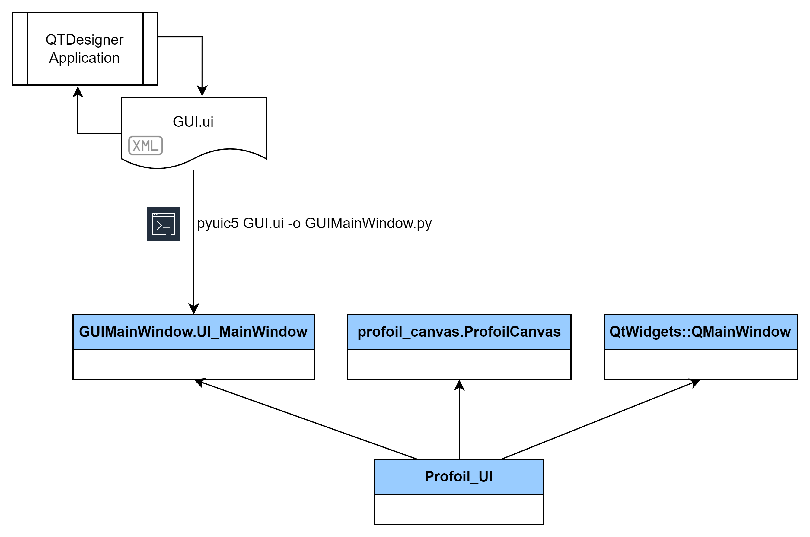
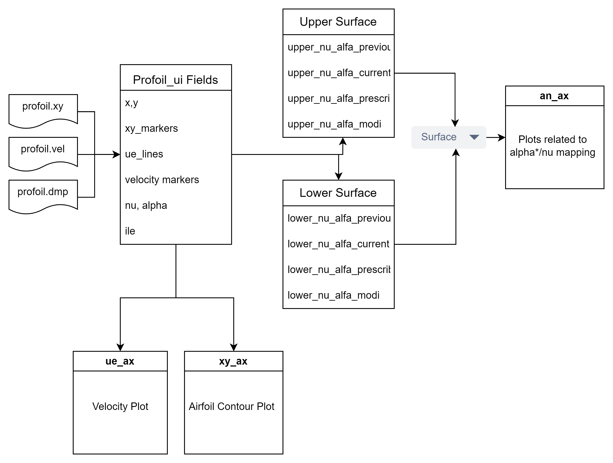

# Developer Documentation

## Files and their purpose.

- GUIMainWindow.py
  
  This file contains the code responsible for rendering the main Window.

- preferences.py
  
  This file contains a list of variables that can be changed by the user as they prefer. For example plot line colors, line styles, default plot limits etc.

- profoil_canvas.py
  
  canvas is the container which contains all the plots. main data structure is just a simple matplotlib figure. when binding in to the pyqt main window this will be casted from matplotlib.figure.Figure in to matplotlib.backends.backend_qt5agg.FigureCanvasQTAgg

- profoil_interface.py
  
  Profoil_interface provides list of functions to extract information from text files generated on each PROFOIL run. extract_all_data() function is particularly interesting as it handles all the heavy lifting and returns all the information back into profoil_ui at once.

- profoil_ui.py
  
  profoil_ui is the entry point of the program. Initializing, Subclassing the classes from previously listed files, and setting up the program happens here.

## Class Hierarchy and WorkFlow

As shown below, profoil UI inherits from multiple classes. UI_MainWindow is the class responsible for generating the main window. Profoil_UI extends the base class with call back methods for button clicks etc. ProfoilCanvas is the main figure canvas where all the graphs being plotted. 

Additionally Profoil_UI inherits from QtWidgets::QMainWindow class to return properly typed instance when selecting a file through file explorer window. The cleanest way probably to do this is to extend UI_MainWindow from QMainWindow but that makes it difficult to make changes to the GUI.ui file later on as outlined in the next paragraph. To keep the sanity of completly isolated GUI, multiple inheritance path is chosen here.

 

### Isolation of GUI components

The file GUIMainWindow.py is a computer generated file. This file is being generated by pyuic5 consuming the GUI.ui file. GUI.ui is an xml file outlining the layout of the buttons menu etc and its been generated by QTDesigner.

So for any modificaitons with regards to the easthetics, layout, colors fonts etc one can easily modify the provided GUI.ui file and generate GUIMainWindow.py by running below command. Once done without manually modifying any code, you should be able to run profoil_ui.

```bash
pyuic5 GUI.ui -o GUIMainWindow.py
```

## Data Flow inside the application

As outlined in the user manual after each run of profoil new set of files will be generated by PROFOIL. profoil_interface.py is the module that interfaces with these files mainly. extract_all_data() function in this module extracts all the relevent information from these files. Non-dimensionalized velocity, nu markers and airfoil contuour is directly been plotted in to matplotlib axis as per the standard. 

But nu-alpha plots are done differently because of the requirement to facilitate surface switching. Approach I've taken is to plot nu_alpha related data in to matplotlib Line2D objects which act as suitable "containers" rather than plotting them directly on to a graph. When user switches the surface these Line2D objects will be placed on the actual matplotlib axis. More information can be found in plot_ue(), plot_xy() and plot_nu_alfa() functions. surface switching is happening on select_surface() function.

 

Most of the details outlining the implementations are inserted to file headers as well for easy reference. Also doxygen generated callflow charts are inserted as a quick reference. But use it with cautios because as the project progresses documentation could be outdated.

## Contributing to the documentation

Documentation files (DevDoc and UserManual) are first written in markdown. I used MarkText for this and the files were later been converted to HTML format for offline use. So please use the same workflow so that it ensures both .md and .html files are in sync. 

 

## Test Cases

**Action : File -> Open**     
Expected Result: opens a file and shows Ue distribution, xy coordinates and alpha*-phi distribution and summary.

**Action: Switch to File View**     
Expected Result: Populated text in Profoil.in and Profoil.log text boxes

**Action: Switch back to Design View**     
Expected Result : plots stays as is without being changed. 

**Action: Untick Grid / Tick Grid**     
Expected Result : Grid on alpha*-phi distribution turns on and off

**Action: Switch to Lower surface**     
Expected Result : Ue and XY plots stays the same. alpha*-phi distribution shows lower surface data. 

**Action : Zoom** in and out using "Zoom to rectangle" button.     
Expected Result : Zooms in and out keeping the same aspect ratio.

**Action: Switch surface without pressing home button**     
Expected Result : Upon returning lower or upper surface, the zoomed out plot statys zoomed out. 

**Action: Start Edits**     
Expected Result : 
                Start Edits button text turn red indication edit mode. 
                When in alpha*-phi plot the cursor becomes cross-hair
                Left click allows the user to add cursor edits showing as a red line

**Action: Cancel**     
Expected Result : red cursor line disapears and no data is changed

**Action : Apply Edits** (After Start Edits)     
Expected Result : The green line that prescribes the alpha*-phi distribution gets the cursor edit data from the red line.
**Action : Undo**     
Expected Result: The green line gets the previous alpha*-phi distribution which was there before the Edits.

**Action : Plot From File** (Change the profoil.in file in the File View. Do some changes to the FOIL lines and then in the Design View -> click Plot From File)     
Expected Result: The changes made in the FOIL lines should reflect in the alpha*-phi distribution including any alpha*-phi changes and/or any newly introduced FOIL lines.

**Action : Run Profoil** (After doing some minute change either in Design View or File View)     
Expected Result : New set of Ue , xy and alpha*-phi showing old and new data

**Action : Untick/Tick History**     
Expected Result : Dashed gray history lines apprear/disapear as applicable. 

**Action : Revert** (After doing some Edits and then Run Profoil)     
Expected Result : The green line gets the alpha*-phi distribution that was there before the edits.

**Action : Overlay** -> Select a saved xy file or XFoil dat file.      
Expected Result: The geometry should appear in a dotted red line in the xy plot

**Action : Clear Overlay**     
Expected Result : Overlay line disapears.

**Action : Open at least 10 differnt airfoil .in files**     
Expected Result : on each open airfoils open in the window without messing up the plot limts, AR etc. 
