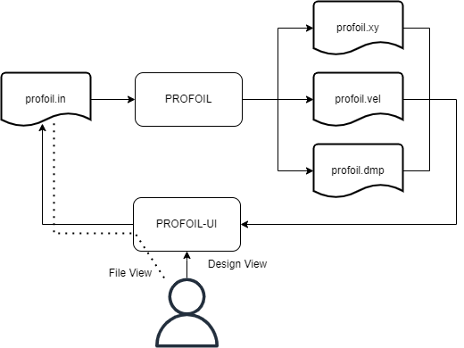
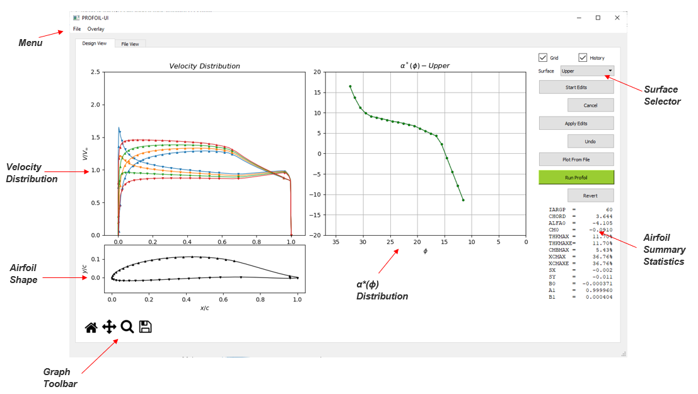
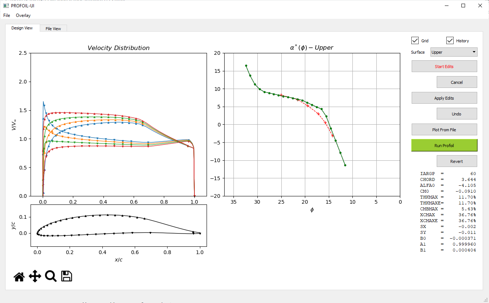
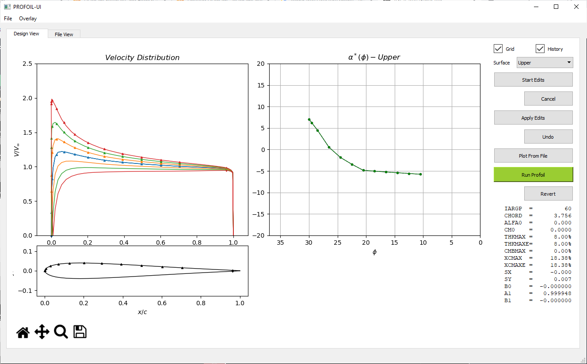

# PROFOIL-UI

A Python based graphical user interface for the multi-point inverse airfoil design code PROFOIL.

## What is PROFOIL-UI

PROFOIL-UI is a minimalistic GUI front-end for [PROFOIL](https://github.com/m-selig/PROFOIL).  In PROFOIL, an airfoil is chiefly defined by its α\*(ϕ) distribution.  The new PROFOIL-UI can be used to edit an α\*(ϕ) distribution and thereby define a new airfoil through iteration.  Mouse cursor edits to the α\*(ϕ) distribution are made through the UI.  The UI can be used to display both the current and prior airfoil to better examine how the airfoil evolves iteratively through the design process.

The diagrams below illustrate the typical PROFOIL work-flow along with the PROFOIL-UI work-flow to show how the two programs fit together.

 



Note that the interfacing between PROFOIL and PROFOIL-UI is done via text files. Users may chose to edit the α\*(ϕ) distribution via cursor edits while making other possible modifications into the _profoil.in_ file as indicated by the dotted line in the figure above. (For example adding a new FOIL line or modifying NEWT* lines).

## Pre-requisites / Assumptions

Users are assumed to have some basic theoretical understanding of the multi-point airfoil design methodology proposed by Eppler, Selig et al. Some exposure to PROFOILs functionality and keywords will certainly be helpful. Also an error free profoil.in file is required to start a session. 

## Installation

If you have a Python development environment like Anaconda and PyQt5 already installed, it should be sufficient to run PROFOIL-UI straight away. Otherwise a new Python environment can be created, and all the dependencies can be installed via:

```sh
pip install -r requirements.txt
```

The necessary folders and files for a PROFOIL install are shown below (png files in **./doc_media** and **.in** files in the example folder are indicated by *).

```
.
├── bin
│   └── profoil.exe
├── docs
│   └── PROFOIL-User-Guide-2022.pdf
├── license
│   └── license.txt
├── runs
│   └── examples
│       ├── example1.in
│       ├── example2.in
│       └── *.in
├── ui
│   ├── Manual.html
│   ├── PROFOIL-UI.bat
│   ├── README.md
│   ├── README.txt
│   ├── doc_media
│   │   └── *.png
│   ├── preferences.py
│   ├── profoil_canvas.py
│   ├── profoil_interface.py
│   ├── profoil_ui.py
│   ├── pyqt_designer.ui
│   └── requirements.txt
└── work
```

## Starting PROFOIL-UI

Per above, in a typical distribution, PROFOIL-UI is conveniently placed in the **./ui** sub-folder. It can either be run by double clicking **PROFOIL-UI.bat** file or triggering a Python shell by navigating to the **./ui** folder and typing the line below into the Windows command prompt.

```sh
python profoil_ui.py
```

## Loading an Airfoil

Upon starting, users can load an airfoil by choosing the input file (a valid PROFOIL .in file) through the <kbd>File</kbd> menu.
The installation includes the sample files in the **./runs** folder. Choosing one of the samples, e.g. **../runs/examples/example1.in** will load the file into the program to run the executable PROFOIL (**./bin/profoil.exe**).
Below screen-shot shows the initial plot followed by descriptions on each pane and widget. 



**_Velocity Distribution_**

This graph shows the non-dimensionalized velocity distribution over the airfoil surface. Each line corresponds to each angle of attack specified in the .in file through the __ALFASP__ line. Each velocity distribution curve has upward and downward pointing triangles (markers) to indicate the segment ϕ values on upper and lower surfaces respectively. Note that the triangles on upper and lower surfaces near the trailing edge indicate the upper and lower ϕ<sub>S</sub> closure arc limits.

**_Airfoil Shape_**

The airfoil plot shows the non-dimensionalized airfoil coordinates 𝓍,𝓎 along with the ϕ markers as described above. The airfoil is drawn to scale (i.e. aspect ratio 1:1) so that the airfoil shape is not distorted. No clipping on axes boundaries were used so that the complete airfoil can be seen when using the zoom function.  To zoom, use the magnifying glass (lower left) to click-and-drag a region, and then to un-zoom use the home button successively.

**_α\*(ϕ) Distribution (Upper and Lower)_**

This is the main interactive plot that allows the user to introduce cursor edits to the upper and lower surface α\*(ϕ) distributions.
The current converged α\*(ϕ) distribution which is modifiable using the cursor edits is shown in green.

**_Upper and Lower surface selector_**  
Selects the active surface for α\*(ϕ) cursor edits. Users may choose to switch back and forth during an edit.

**_Grid Check Box_**  
Toggles the grid on the α\*(ϕ) distribution

**_History Check Box_**  
Toggles the visibility of the plots corresponding to the previous case mainly used for reference purposes.

## Running

Once the airfoil is first loaded and initial plots were made, subsequent changes can be done to the airfoil velocity distribution using the button/mouse actions described below.   

Buttons are arranged in pairs such that one main action is followed by a possible reverse action for easy reference. For example "Start Edits" button immediately followed by "Cancel" meaning any edits which did not turn out to be as expected can be discarded. The same logic is applicable for "Apply Edits" -> "Undo" and "Run Profoil" -> "Revert" button pairs. 

**_Start Edits Button_**  
This button initiates cursor edit functionality. "Edit mode" will be activated once clicked and it will be toggled on the subsequent clicks. Active "Edit Mode" is indicated by red text on the button. Once in "Edit mode", successive left mouse button clicks on the α\*(ϕ) graph introduces a new red cursor edit line. This cursor edit line prescribes the altered α\*(ϕ) distribution which will later be applied on to the existing α\*(ϕ) distribution. Please note that this new α\*(ϕ) distribution can be introduced by clicking anywhere in the α\*(ϕ) graph in any order and does not have to span through the complete original distribution. For example, if a section of the airfoil to be altered is ranging between 15<ϕ<25, this red cursor edit line does not have to go beyond those segment limits.



**_Cancel Button_**   
Cancels the cursor edit lines introduced in the previous step (red curve).

**_Apply Edits Button_**    
Previously introduced α\*(ϕ) distribution indicated by the red cursor edit line, will be applied to the current α\*(ϕ) distribution shown in green by triggering this button. Upon triggering, the cursor edit α\*(ϕ) distribution will be linearly interpolated and applied, such that the α\* values of the existing green curve will be altered if the corresponding ϕ values falls within the limits of the edits. (This is way easier to understand in practice than it sounds). The modified α\*(ϕ) distribution will then be saved to profoil.in file making the program ready to run PROFOIL. Before each save, backup file of _profoil.in_ will be generated as _buffer.in_ in **./work** directory.


**_Undo Button_**   
Undo Edits button is used to undo all the changes that were introduced to the α\*(ϕ) distribution in the "Apply Edits" step BEFORE running PROFOIL. 

**_Plot From File Button_**    
As indicated above in the PROFOIL-UI work flow, changes can be done to the profoil.in file manually as required. These changes could generally be in any form including addition of FOIL lines. Before running PROFOIL, these newly introduced FOIL lines could be inspected prior to running PROFOIL using this button. 

**_Run PROFOIL Button_**   
The "Run Profoil" button runs PROFOIL as the name implies. 
This button operates by taking the following actions under the hood.

- Executes **profoil.exe** in **./bin** directory, from **./work** directory so that the resulting files will be in the **./work** directory
- Extracts the required details from _profoil.vel, profoil.xy_ and _profoil.dmp_ files and updates the plots.

There will be 4 lines in total in the α\*(ϕ) plot right after a new airfoil is designed (if the program is successfully executed). 

- Black dashed line:     shows converged data from the previous run.   
- Blue dashed line:     shows prescribed α\*(ϕ) curve.   
- Purple line:             shows converged data from the most recent run.   
- Green line:             shows modifiable α\*(ϕ) distribution using the cursor edits.   


Notes :   

- Black and Blue lines will not be shown in the initial plot because there is no history to show.   
- Green and purple lines always coincide just after the run. For demonstration purposes, green line was moved away from the purple one in the attached screen-shot.

Once PROFOIL execution finishes, the previous design will be shown in dashed-grey lines and the new design will be shown in solid lines. Typically it is assumed that each successful PROFOIL run will be followed by an analysis session through XFoil or some other means to verify if the intended changes were indeed met. 

Notes :   

- If for some reason, the prescribed α\*(ϕ) distribution does not result in successful design, the plots will not be updated and failure will be indicated through a warning message. 
- Summary statistics (last 14 lines of profoil.log file) will be displayed in the "Summary" section in the right bottom of the window for successful runs and complete log files could further be inspected in <kbd>File View</kbd> tab. 
- In case if the program crashes for some unexpected reason, the buffer.in file which is one iteration behind the current profoil.in file can be found in the **./work** directory.  

During this iterative process, geometric overlay could be referenced using the <kbd>Overlay</kbd> menu. In this menu <kbd>\*.dat</kbd> file refers to any file containing 𝓍,𝓎 coordinates with up to 2 header files. This covers profoil.xy files generated by PROFOIL, XFoil format dat files and MSES blade files. The overlay will be kept in the airfoil plot until they will be manually cleared through <kbd>Overlay</kbd> -> <kbd>Clear Overlay</kbd> function.


**_File View Tab_**    
File View tab allows users to make required modifications to profoil.in file within the application and explore the log in finer details. 


Finally, once the design requirements are met, the most recent profoil.in file in **./work** directory which corresponds to the final design iteration, can be saved into a user specified destination using <kbd>File</kbd> -> <kbd>Save</kbd> function.

## Special Notes

1. For symmetrical airfoil with **SYM** flag in the _.in_ file, _profoil.dmp_ file will be generated without the lower surface α\*(ϕ) distribution. This leads to the plots in PROFOIL-UI to show only the upper surface α\*(ϕ) markers accordingly. This aligns very well on how PROFOIL treats **SYM** flag as it reads only the upper surface α\*(ϕ) distribution and discards the FOIL lines past ILE. In practice, if one wants the graphs to show the lower surface α\*(ϕ) markers as well, then **SYM_TOGGLE** flag should be used just before the **DUMP** line in the _profoil.in_ file. 

Below images show the program output, without SYM_TOGGLE option and with SYM_TOGGLE option for better clarity.




2. **VELDIST** line must to used with **60** which makes PROFOIL to list velocity distributions as V/V<sub>∞</sub>(ϕ) instead of V/V<sub>∞</sub>(𝓍). This helps to split the long single stream of velocity distributions to each AoA with ease and helps interpolate to find out the correct marker positions on the plots.

## License

MIT License

```
Copyright (c) 2022 Kanishka Jayawardane [kanishkagj@yahoo.com]

Permission is hereby granted, free of charge, to any person obtaining a copy
of this software and associated documentation files (the "Software"), to deal
in the Software without restriction, including without limitation the rights
to use, copy, modify, merge, publish, distribute, sublicense, and/or sell
copies of the Software, and to permit persons to whom the Software is
furnished to do so, subject to the following conditions:

The above copyright notice and this permission notice shall be included in all
copies or substantial portions of the Software.

THE SOFTWARE IS PROVIDED "AS IS", WITHOUT WARRANTY OF ANY KIND, EXPRESS OR
IMPLIED, INCLUDING BUT NOT LIMITED TO THE WARRANTIES OF MERCHANTABILITY,
FITNESS FOR A PARTICULAR PURPOSE AND NONINFRINGEMENT. IN NO EVENT SHALL THE
AUTHORS OR COPYRIGHT HOLDERS BE LIABLE FOR ANY CLAIM, DAMAGES OR OTHER
LIABILITY, WHETHER IN AN ACTION OF CONTRACT, TORT OR OTHERWISE, ARISING FROM,
OUT OF OR IN CONNECTION WITH THE SOFTWARE OR THE USE OR OTHER DEALINGS IN THE
SOFTWARE.
```
